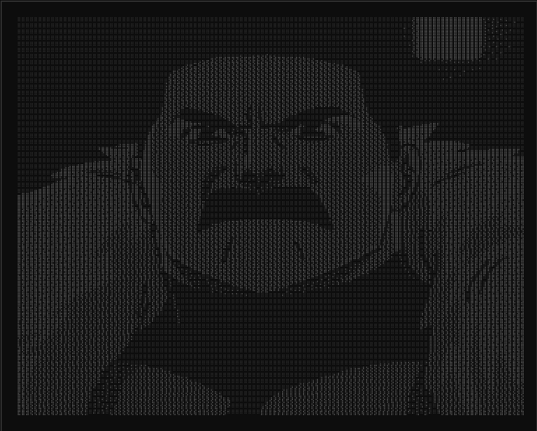
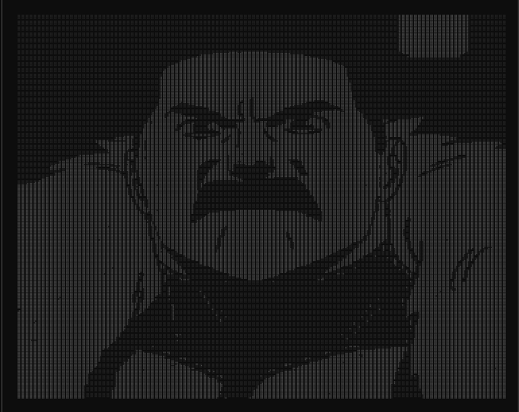

# Braille Art

A browser based tool that converts images into Unicode braille characters. Drop in a photo, tweak the settings and get a text art version you can paste anywhere.

## Features

- **Image input** — drag and drop, click to upload or paste from clipboard
- **Live preview** — thumbnail of the source image shown alongside the braille output
- **Adjustable controls** — threshold, contrast, width (10–300 chars), invert and dither
- **Brightness modes** — perceived (luminance), midtone (lightness), balanced (average)
- **Export** — copy to clipboard or download as `.txt`
- **Fully client-side** — no server, no uploads, everything runs in the browser

## Screenshots

### Dither On



### Dither Off



## How It Works

1. The image is drawn onto a hidden canvas at a size determined by the column width setting.
2. Pixel brightness is computed per dot using the selected mode (luminance, lightness, or average).
3. Each 2×4 dot cell maps to a Unicode braille character (`U+2800`–`U+28FF`) based on which dots exceed the threshold.
4. Optional Floyd-Steinberg dithering is applied before dot mapping for better tonal detail.

## Getting Started

```bash
bun install
bun dev
```

Open `http://localhost:5173` in your browser.

## Scripts

| Command | Description |
|---|---|
| `bun dev` | Start development server with HMR |
| `bun build` | Production build to `dist/` |
| `bun preview` | Preview the production build locally |
| `bun lint` | Run ESLint |

## Built With

- [React 19](https://react.dev) — UI
- [Vite](https://vite.dev) — build tooling
- [Bun](https://bun.sh) — runtime and package manager

## Tips

- High-contrast images with clear subjects produce the best output.
- Enable **dither** for photographs or images with gradients.
- Use **invert** when your source image has a dark subject on a light background.
- Wider column counts (80+) capture more detail but need a monospace font to display properly.
